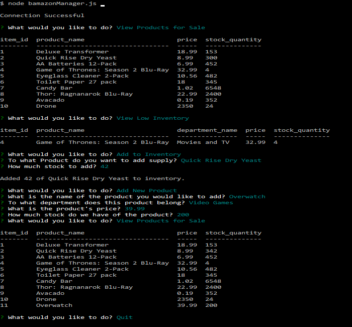
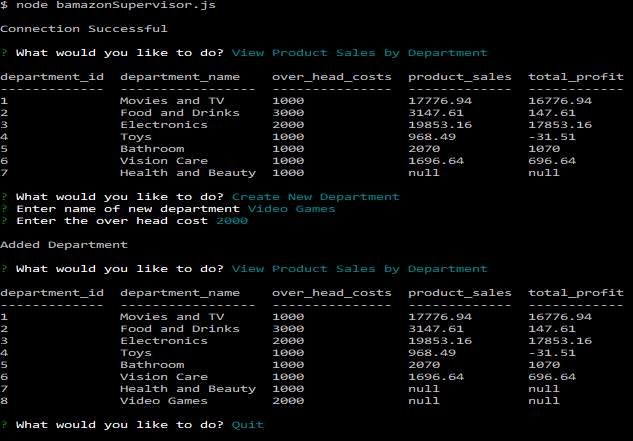

# Bamazon

>Bootcamp Homework: Console interface for fictional store inventory

## Install

Setup a local MySQL database with username root on port 3306, set the password to anything you want. Run the `schema.sql` file to setup the tables and load them with test data. Install dependencies with `npm install` in your terminal. First time any of the programs are run they should ask for the password of the MySQL database.  

## BamazonCustomer

Customer can purchase items from the database in quantities that can't exceed the stock. Items are selected by their ID.

## BamazonManager

Manager can look at what is for sale, check low inventory, add stock for items, or add new items for sale.

## BamazonSupervisor

Supervisor can view product sales by department and create new departments. 

### Dependencies

[mysql](https://www.npmjs.com/package/mysql) version: 2.15.0

[inquirer](https://www.npmjs.com/package/inquirer) version: 3.3.0

[console.table](https://www.npmjs.com/package/console.table) version: 0.9.1